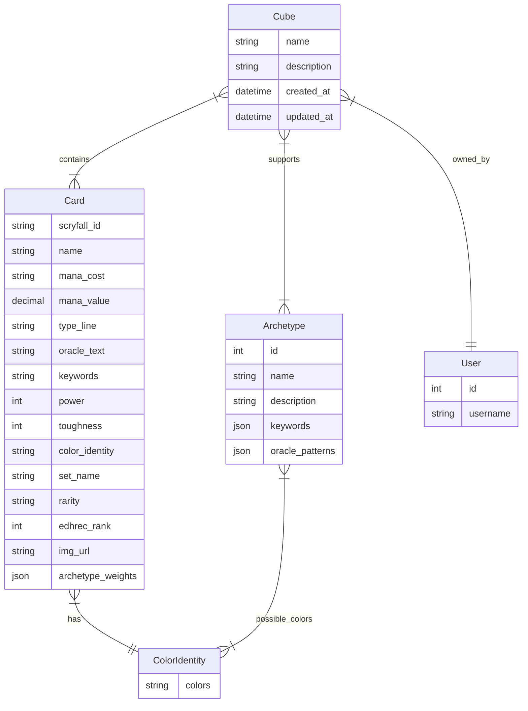

# MTG-Cube-Generator

**Learning SQL and creating a draftable set of cards for a variety of Magic the Gathering experiences**

## MTG Cube Generator Problem Statement:

I want to generate a commander cube based on a chosen set of deck archetypes.

## Target Audience:

- Entrenched Magic Players
- Players new to limited formats that don’t want to spend money

## MVP Features:

- Fully searchable card database by all the data fields provided in the original model as well as searching by archetype.
- Users can set limits on several factors when generating a cube:
  - Size of cube
  - Size of packs
  - Commander distribution
  - Color distribution
  - Card type distribution
  - Choice of sets
  - Power level
  - Choice of archetypes
- Ability for users to save and edit cubes
- User Authentication and Profile Management

## Additional Features:

- Users can upload their own collection and discover which archetypes are well supported
- Generate cubes out of the user’s collection

## System Architecture:

| Component  | Technology                                                                 |
|------------|-----------------------------------------------------------------------------|
| Frontend   | HTML, CSS, and Javascript (React.js)                                        |
| Backend    | Django                                                                      |
| Database   | Supabase                               |
| API        | Scryfall integrated API ([https://scryfall.com/docs/api](https://scryfall.com/docs/api)) |
| Hosting    | Render                                                                      |

## Database Design - Models:

### Django User Model

This is the default model provided by Django for user authentication and profile management.

## Models

### Card

Represents a Magic: The Gathering card with all its attributes and archetype relationships.

| Field Name | Type | Description | Constraints |
|------------|------|-------------|-------------|
| `scryfall_id` | CharField | Unique identifier from Scryfall | max_length=255 |
| `name` | CharField | Name of the card | max_length=255 |
| `mana_cost` | CharField | The mana cost string (e.g., "{2}{U}{U}") | max_length=50, nullable |
| `mana_value` | DecimalField | Converted mana cost (e.g., 4.0) | max_digits=10, decimal_places=2 |
| `type_line` | CharField | Complete type line of the card | max_length=255 |
| `oracle_text` | CharField | Rules text of the card | max_length=1000, nullable |
| `keywords` | CharField | Mechanical keywords on the card | max_length=500, nullable |
| `power` | IntegerField | Power for creatures | nullable |
| `toughness` | IntegerField | Toughness for creatures | nullable |
| `color_identity` | CharField | Color identity of the card | choices from ColorIdentity |
| `set_name` | CharField | Name of the set the card is from | max_length=255 |
| `rarity` | CharField | Card's rarity | max_length=50 |
| `edhrec_rank` | IntegerField | Popularity ranking from EDHREC | indexed |
| `img_url` | URLField | URL to the card's image | - |
| `archetype_weights` | JSONField | Mapping of archetype IDs to weights | default=dict |

#### Methods

```python
def get_archetype_weight(archetype_id) -> int:
    """
    Get the weight (1-10) for a specific archetype.
    Returns 0 if archetype not found.
    """

def set_archetype_weight(archetype_id, weight):
    """
    Set the weight (1-10) for a specific archetype.
    Removes the archetype if weight <= 0.
    """

@property
def primary_archetypes() -> List[str]:
    """
    Returns list of archetype IDs where weight >= 7.
    """
```

### Archetype

Defines a deck archetype or strategy pattern in Magic: The Gathering.

| Field Name | Type | Description | Constraints |
|------------|------|-------------|-------------|
| `id` | AutoField | Primary key | primary_key=True |
| `name` | CharField | Name of the archetype | max_length=255, unique=True |
| `description` | CharField | Description of the archetype strategy | max_length=500 |
| `possible_colors` | ManyToManyField | Valid color combinations for this archetype | to=ColorIdentity |
| `keywords` | JSONField | List of keywords associated with archetype | default=list |
| `oracle_patterns` | JSONField | Regex patterns for oracle text matching | default=list |

### ColorIdentity

Represents possible color combinations in Magic: The Gathering.

| Field Name | Type | Description | Constraints |
|------------|------|-------------|-------------|
| `colors` | CharField | String of color letters | max_length=10, unique=True |

#### Available Color Combinations

```python
COLOR_CHOICES = [
    ('W', 'White'),
    ('U', 'Blue'),
    ('B', 'Black'),
    ('R', 'Red'),
    ('G', 'Green'),
    ('C', 'Colorless'),
    # Two-Color Combinations
    ('UW', 'White-Blue'),
    ('BW', 'White-Black'),
    # ... (all other valid combinations)
    ('BGRUW', 'Five-Color')
]
```

### Cube

Represents a custom cube draft environment.

| Field Name | Type | Description | Constraints |
|------------|------|-------------|-------------|
| `name` | CharField | Name of the cube | max_length=255 |
| `description` | CharField | Description of the cube | max_length=1000 |
| `cards` | ManyToManyField | Cards included in the cube | to=Card |
| `archetypes` | ManyToManyField | Supported archetypes in the cube | to=Archetype |
| `user` | ForeignKey | Owner of the cube | to=User, on_delete=CASCADE |
| `created_at` | DateTimeField | When the cube was created | auto_now_add=True |
| `updated_at` | DateTimeField | When the cube was last modified | auto_now=True |

## Relationships

### Key Relationships Overview
- Each `Card` has one `ColorIdentity`
- Each `Card` can belong to multiple `Archetypes` with different weights (stored in JSONField)
- Each `Archetype` can have multiple possible `ColorIdentities`
- Each `Cube` belongs to one `User`
- Each `Cube` contains many `Cards`
- Each `Cube` supports multiple `Archetypes`

### Example Queries

```python
# Get all cards that strongly support an archetype (weight >= 7)
strong_archetype_cards = Card.objects.filter(
    archetype_weights__has_key=str(archetype_id)
).filter(
    archetype_weights__contains={str(archetype_id): 7}
)

# Get all cubes supporting a specific archetype in certain colors
archetype_cubes = Cube.objects.filter(
    archetypes=archetype,
    color_identity__colors__contains='UW'
)
```



Database objectives:

- Develop Scryfall API call that cleans and filters irrelevant data ✔
- Render data in my model ✔ 
- Run test queries ✔
- Determine if a color identity table is necessary for full functionality
- Test Query Set for simple archetypes

Archetype Queries with EDHREC unofficial API:

- Pull archetypes from edhrec.com using python wrapper (https://pypi.org/project/pyedhrec/)
- Pull oracle text for the 200 most popular cards in each archetype
- Write python script to query data set for all relevant cards based on string templates found in oracle text
- Provide archetype weighting to rules text that fits multiple archetypes

OR

Crowdsourced Archetype definitions:

- Gather archetypes from EDHREC and poll players on their favorites.
- Ask those with an affinity for a particular archetype what rules text templates they think exemplifies the archetype.
- Develop scripts for each and every archetype


### EXAMPLE BULK DATA ARCHETYPE SCRIPT

# Example archetype analysis function
def analyze_card_for_archetype(card, archetype):
    weight = 0
    # Check keywords
    for keyword in archetype.keywords:
        if keyword in card.keywords:
            weight += 2
    
    # Check oracle text patterns
    for pattern in archetype.oracle_patterns:
        if re.search(pattern, card.oracle_text):
            weight += 1
    
    # Normalize weight to 1-10 scale
    return min(max(weight, 1), 10)

# Bulk processing example
  ```python
  def process_all_cards():
      archetypes = Archetype.objects.all()
      
      # Process in chunks to manage memory
      for cards in Card.objects.iterator(chunk_size=1000):
          for card in cards:
              weights = {}
              for archetype in archetypes:
                  weight = analyze_card_for_archetype(card, archetype)
                  if weight >= 3:  # Only store significant weights
                      weights[str(archetype.id)] = weight
              
              if weights:  # Only update if card has any archetype matches
                  card.archetype_weights = weights
                  card.save()
  ```
# Query example for cube generation
  ```python
  def find_cards_for_archetype(archetype_id, min_weight=7):
      return Card.objects.filter(
          archetype_weights__has_key=str(archetype_id)
      ).filter(
          archetype_weights__contains={str(archetype_id): min_weight}
      ).order_by('edhrec_rank')
  ```    